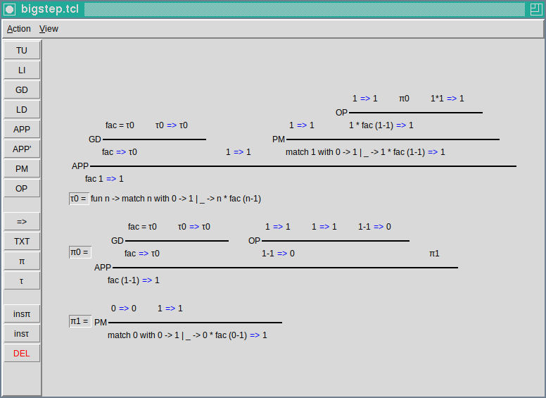

# BigStep Tool

A Tcl/Tk script written to interactively demonstrate BigStep notation in
my Functional Programming and Verification tutorials at the Technical
University of Munich.

Screenshot:



## Dependencies

The script requires Tcl/Tk being installed on the system. On Debian, this can
be done with:
```sh
apt install tk
```

On Gentoo:
```sh
emerge -av dev-lang/tk
```

Other Linux distributions should have a similar package. In particular, the
script uses `wish` (**wi**ndowing **sh**ell). Verify that it was installed
with the package.

It should be possible to install Tcl/Tk on Windows and Mac also, see
[this page](https://www.tcl-lang.org/software/tcltk/). However, this hasn't
been tested with the script.

## Running the script

After the necessary dependencies have been installed, just do:
```sh
chmod +x bigstep.tcl
./bigstep.tcl
```

## Limitations

- No scrolling. If you run out of space, you run out of space.
- No way to export the result. (Though it is possible to take a screenshot
  with any screenshot program.)
